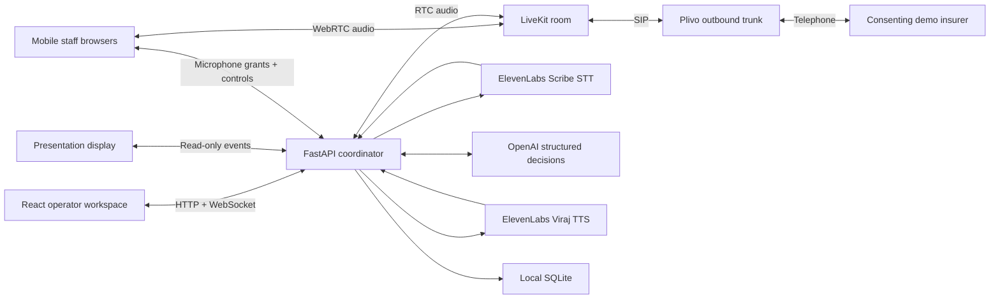

# ATP · Access to Prescription

A hackathon prototype for one continuous prior-authorization conversation: **AI → doctor → AI**, with repeat handoffs when needed. A local Python service coordinates a LiveKit room, an outbound Plivo SIP call, OpenAI reasoning, and ElevenLabs Scribe/Viraj speech. Doctors join by answering a regular incoming phone call; a separate presentation view shows the conversation and captured facts.

## Run

Your `.env` is already configured. From this directory:

```sh
make demo
```

Open the printed local URL, sign in with `APP_DEMO_PASSWORD`, and run **Connection check**. The launcher prints a temporary HTTPS URL for phones. Keep the laptop awake and its terminal running.

1. Under **Call destinations**, save the **insurer phone number** and **doctor phone number** in international format. They are separate receiving numbers; ATP's Plivo number remains the outbound caller ID. The settings persist locally and are copied onto each new call.
2. Click **Start insurer call**. ATP dials the insurer; the recipient answers and presses **1** to confirm. ATP then introduces itself automatically. Both phone legs ring for up to 30 seconds and require confirmation within 10 seconds of answering. Voicemail or an unconfirmed answer gets a short goodbye and is disconnected without entering the authorization conversation. Carrier forwarding can happen before the ringing limit.
3. When ATP needs human input, it pauses its routine conversation, **calls the saved doctor number**, and posts a **Slack briefing** to the private ATP channel with recent discussion, what is needed, and a private control link.
4. The doctor answers the ordinary incoming phone call and **presses 1** to join the **same insurer conversation**. ATP stays silent and transcribes the doctor's contribution. Ringing lasts up to 30 seconds; a private prompt allows 10 seconds after pickup to press 1. Voicemail stays outside the insurer conversation. A recognized voicemail greeting or missing confirmation ends the doctor attempt after a short goodbye; ATP tells the insurer the doctor is unavailable and asks to arrange a callback. A carrier can forward to voicemail earlier than 30 seconds.
5. The doctor presses **# on the phone call's keypad**, or taps **Return to AI** in the Slack-linked control page. ATP ends only the doctor's phone connection, keeps the insurer connected, and resumes with the new context. It can ring the doctor again on a later escalation.
6. On the laptop choose **Presentation view** to display the live conversation and facts. **Listen** enables monitoring audio.
7. End the insurer call from the operator screen. **Call history** and **Export JSON** retain the outcome.

The Slack-linked control page does not use a browser microphone. The doctor can use native phone audio with the screen locked and press # to hand back. Browser links remain available as a rehearsal/manual fallback.

Slack status distinguishes **posted**, **failed**, and **not confirmed**. Posted means Slack acknowledged the message, not that the doctor read it or received a push alert. A failed Slack notification does not prevent the doctor phone call. A failed/no-answer doctor call keeps the insurer connected and resumes AI to arrange a callback. Only an explicit operator retry rings the doctor again after a failed attempt.

For **Browser rehearsal**, no telephone number is dialed. The invite panel adds an **Insurer representative** role whose browser microphone substitutes for the phone. This mode is clearly labeled.

## Setup from a fresh checkout

Requires Node.js 22+, `uv`, Python 3.12, and [cloudflared](https://developers.cloudflare.com/cloudflare-one/connections/connect-networks/downloads/) for phone-browser HTTPS access. This workspace includes the official macOS ARM cloudflared binary in ignored `.local/bin/`.

```sh
cp .env.example .env     # only on a fresh checkout; don't overwrite existing credentials
make setup
make doctor
make provision          # only if an outbound LiveKit trunk is missing
make demo
```

`make provision` first reuses an existing LiveKit outbound trunk matching the configured caller. If missing, it creates a Plivo outbound trunk and SIP credential and registers them with LiveKit. It does not buy numbers, top up an account, or change existing inbound trunks. Provisioning state and generated credentials stay in ignored `.local/`. If several matching trunks exist, set `LIVEKIT_SIP_TRUNK_ID` explicitly.

## Environment

See [`.env.example`](.env.example) for exact names. No provider keys go to the browser.

| Variable | Purpose |
| --- | --- |
| `OPENAI_API_KEY`, `OPENAI_MODEL` | Typed conversation decisions and evidence extraction |
| `ELEVEN_API_KEY`, `ELEVEN_VOICE_ID` | ElevenLabs speech; selected voice is Viraj, `fPIfC3elMLbN9tNwMXkw` |
| `ELEVEN_STT_MODEL` | `scribe_v2_realtime` |
| `ELEVEN_TTS_MODEL` | `eleven_flash_v2_5` |
| `LIVEKIT_URL`, `LIVEKIT_API_KEY`, `LIVEKIT_API_SECRET` | Real-time room and SIP access |
| `LIVEKIT_SIP_TRUNK_ID` | Optional explicit outbound trunk selection |
| `PLIVO_AUTH_ID`, `PLIVO_AUTH_TOKEN`, `PLIVO_PHONE_NUMBER` | Plivo account checks/provisioning and caller number |
| `INSURER_PHONE_NUMBER` | Default insurer receiving number, E.164 |
| `SLACK_WEBHOOK_URL` | Secret incoming webhook for the ATP Slack channel |
| `DOCTOR_PHONE_NUMBER` | Default doctor receiving number for phone calls, E.164 |
| `PUBLIC_BASE_URL` | Optional stable HTTPS app URL for Slack control links; otherwise the active tunnel URL is used |
| `DEMO_PAYER_PHONE_NUMBER` | Legacy fallback for the insurer default |
| `APP_DEMO_PASSWORD` | Operator login |
| `APP_PORT` | Local server port, default `8000` |
| `DATABASE_PATH` | Local SQLite file, default `./.local/atp.sqlite3` |
| `DEMO_MAX_CALL_SECONDS` | Call timeout, clamped to 30–600 seconds |

The UI saves number changes in SQLite; `.env` values seed them on first setup. Cloudflare Quick Tunnels need no API key. The HTTPS address changes when restarted; generate fresh QR links after restarting the tunnel. No Supabase, Vercel, Twilio, SMS provider, or iOS app is required.

## Architecture



- `atp/engine.py`: single-call state machine, exclusive speaker ownership, interruption, escalation, idempotent controls, transcript and facts.
- `atp/voice.py`: per-participant streaming transcription, OpenAI decisions, aligned speech captions, RTC audio, SIP dialing and DTMF.
- `atp/main.py`: login, scoped one-use invitations, signed sessions, role checks, snapshots, WebSocket updates and frontend delivery.
- `atp/providers.py`: credential-safe readiness checks and idempotent trunk provisioning.
- `web/src/`: React operator, mobile and presentation interfaces.
- `scripts/`: launch, setup diagnostics and real-provider smoke tests.

FastAPI runs one worker. This is intentionally one active call on one laptop; don't run multiple workers against the same database. Audio travels directly through LiveKit. Cloudflare carries the web interface and control/events, not telephone media. The laptop runs the voice worker and must remain awake.

Supplied case records and transcript evidence are kept separate. Captured facts link to specific non-AI transcript turns; hover a value for its source. Authorization and medication access have separate fields. Source evidence is editable before a call. Private handoff briefings are excluded from presentation/payer snapshots.

Turn-taking allows 1.3 seconds of silence before Scribe commits speech, followed by a cancellable 0.7-second reply delay. Unfinished phrases get a longer 1.8-second delay. Resumed speech cancels a queued or in-flight response; standalone hesitations do not trigger replies. Optional tuning variables are `ELEVEN_VAD_SILENCE_SECONDS`, `TURN_END_DELAY_SECONDS`, and `INCOMPLETE_TURN_DELAY_SECONDS`. Run `PYTHONPATH=. .venv/bin/python scripts/smoke_pauses.py` to check a mid-sentence pause with real voice services and no phone calls.

### Slack notifications

ATP posts to the private **#atp-demo** channel in the **ATP** workspace. The notification app uses only an incoming webhook: no channel-reading permissions, Slack SDK, or paid messaging service is needed. The secret is saved in the ignored `.env` as `SLACK_WEBHOOK_URL`.

Live doctor briefings contain the recent insurer conversation, what the doctor needs to answer, phone keypad instructions, and a **Briefing & call controls** button. Confirmed final approvals post **Your DocUpdate has been updated**, with a **View in DocUpdate** button after the call ends. This is a wording change reflecting the intended product flow: the doctor initiates a request in DocUpdate, ATP handles the workflow, and the result updates that request. The prototype's request creation and integration behavior have not changed. Browser rehearsals create approval links without posting completion notifications. Slack buttons open the existing secure web pages; no Slack interactivity callback or slash commands are configured.

For a fresh workspace, create a Slack app, enable **Incoming Webhooks**, and add a webhook for the private demo channel. Save it as `SLACK_WEBHOOK_URL` and restart ATP. See [Slack’s official webhook setup guide](https://docs.slack.dev/messaging/sending-messages-using-incoming-webhooks/). Keep Slack notifications enabled on the doctor’s phone. SMS sending and delivery polling have been removed; Plivo remains the phone carrier.

## Verify

```sh
make test              # unit/API tests + lint + TypeScript + production build; no paid calls
make smoke             # real LiveKit + ElevenLabs + OpenAI, no telephone call
PYTHONPATH=. .venv/bin/python scripts/smoke_handoffs.py  # full real-provider handoff rehearsal
PYTHONPATH=. .venv/bin/python scripts/smoke_screening.py # real room transfer + voicemail screening, no phone calls
```

The smoke checks consume sponsored API usage and LiveKit allowance. Phone calls consume Plivo/LiveKit trial allowance. No purchases are automated.

## Prototype limits

Use synthetic records and consenting test participants only. This is not a production healthcare deployment, an actual payer/EHR/Impiricus integration, or a clinical decision system. It does not claim HIPAA compliance. Real deployment needs those integrations and operational/privacy controls.

The primary doctor flow uses a regular incoming telephone call, with native phone audio. Only the browser-audio rehearsal fallback requires the browser to remain foregrounded and unlocked; there is no native iOS app. Physical Safari microphone permissions and device/audio routing should be rehearsed on the actual pitch phones. Transcription, model decisions and field extraction can be wrong; inspect the transcript and captured evidence. There is no call recording, upload/OCR, voice cloning, autonomous treatment advice, or outcome guarantee.

API keys and provider setup state are ignored by Git. SQLite and signed-session secrets are local under `.local/`. Invitations expire after two hours; LiveKit join tokens expire after twenty minutes. The public tunnel is password/session protected, temporary, and intended only for the demo.
